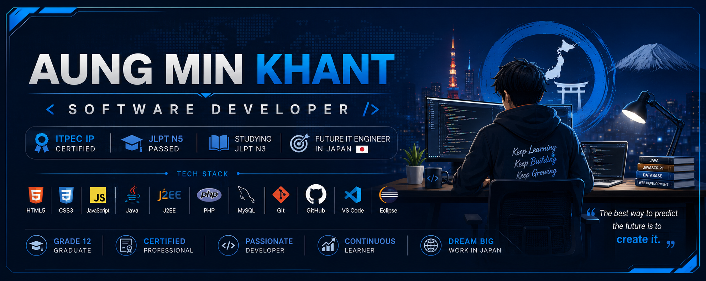

<p align="center">
  
</p>
<h1 align="center">Hi 👋, I'm Aung Min Khant</h1>

<h3 align="center">
Aspiring Software Developer | ITPEC IP Certified | Future IT Engineer in Japan 🇯🇵
</h3>

<p align="center">
  
</p>

---

## 🚀 About Me


- 💻 Passionate about Software Development
- 🎓 Grade 12 Graduate
- 🏅 ITPEC IP Certified
- 🇯🇵 JLPT N5 Passed
- 📚 Currently Studying JLPT N3
- 🌱 Learning PHP Development
- 🗣️ English Speaking Intermediate Level
- 🎯 Goal: Work as an IT Engineer in Japan

<br>

---

## 🛠️ Tech Stack

### Frontend
<p>

</p>

### Backend
<p>

</p>

### Database
<p>

</p>

### Tools
<p>

</p>

---

# 🚀 Featured Projects

### 🛕 Mahar Wiya Myat Buddha

> Buddhist Educational Website

**Technologies:** HTML, CSS, JavaScript

✨ Features

- Buddha Speeches
- Buddhist Knowledge Tests
- Responsive Design
- Educational Resources

---

### 📚 Library Management System

> Library Operation Management Software

**Technologies:** HTML, CSS, JavaScript, Java SE (J2SE)

✨ Features

- Admin Dashboard
- Book Management
- Member Management
- Borrow & Return Books
- Fund Management
- Reports

---

### 🛒 Multi Vendor Marketplace

> E-Commerce Platform

**Technologies:** HTML, CSS, JavaScript, Java EE (J2EE)

✨ Features

- Admin Dashboard
- Seller Dashboard
- Wallet System
- Real-Time Chat
- Product Buying & Selling
- Order Management
- User Management

---

## 📜 Certifications

🏆 ITPEC IP (Information Technology Passport Examination)

🏆 HTML, CSS, JavaScript Certificate

🏆 Java SE (J2SE) Certificate

🏆 Java EE (J2EE) Certificate

🏆 Computer Certificate

🏆 English Speaking Intermediate Certificate

🏆 JLPT N5

---

## 🌱 Currently Learning

```text
PHP Development        ███████████░░░ 80%
Japanese N3            ████████░░░░░ 65%
System Design          ██████░░░░░░░ 50%
Database Optimization  ██████░░░░░░░ 50%
```

---

## 📊 GitHub Stats

<p align="center">
  
  
  
</p>

---

## 🔥 GitHub Streak

<p align="center">

</p>

---

## 🌏 Languages

- 🇲🇲 Myanmar (Native)
- 🇬🇧 English (Intermediate)
- 🇯🇵 Japanese (JLPT N5, Studying N3)

---

## 🎯 Career Objective

I aspire to become a professional Software Engineer and contribute to innovative IT projects in Japan. I continuously improve my technical knowledge, communication skills, and Japanese language proficiency to achieve this goal.

---

## 📫 Connect With Me

📧 Email: aungminnkhant2023@gmail.com

🐙GitHub: https://github.com/blade-khant

---

<div align="center">

### ⭐ Thank you for visiting my profile!

"Keep Learning, Keep Building, Keep Growing."

</div>
